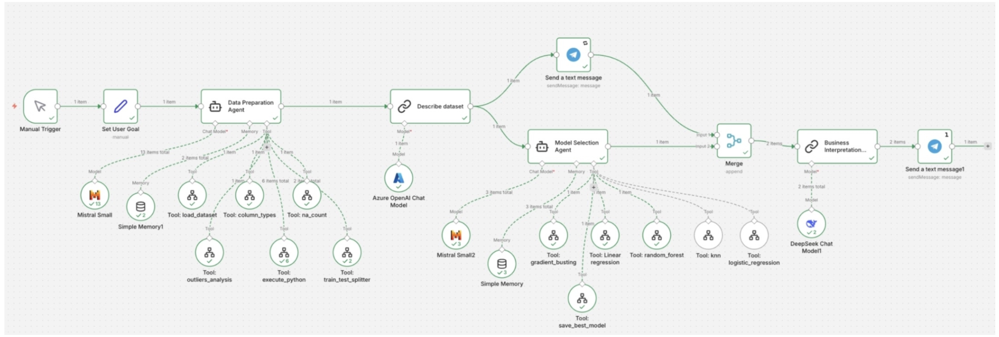

# AI Agent

Полностью автономный ИИ-агент на базе **n8n**, который решает полный цикл ML-задачи: от загрузки датасета Spotify и его анализа до выбора, обучения лучшей модели и отправки бизнес-интерпретации в Telegram.

## Архитектура агента

| Компонент | Роль | Инструменты / Модели |
| :--- | :--- | :--- |
| **Data Preparation Agent** | Автономная подготовка данных: EDA, чистка, feature engineering. | `tool_load_dataset`, `tool_execute_python`, `tool_na_count`, `tool_outlier_analysis`, `tool_train_test_splitter` |
| **Describe dataset** | Форматирование технического отчета для Telegram. | Azure OpenAI (Phi-4) |
| **Model Selection Agent** | Выбор, обучение и сравнение ML-моделей. | `random_forest`, `gradient_boosting`, `linear_regression`, `knn`, `logistic_regression` |
| **Business Interpreter** | Генерация бизнес-отчета на основе ML-метрик. | DeepSeek Chat, Mistral |
| **Memory** | Хранение контекста и истории решений агента. | Simple Memory (кратковременная), Файловая система (долговременная) |

Лучшая модель сохраняется как `the_best_model.pkl`.

## Установка и запуск

Для работы агента требуется собственный экземпляр **n8n**, развернутый на сервере. Так как облачная версия n8n не поддерживает установку библиотек в нодах с кодом на питоне, а так же не позволят работать с долговременой памятью. Помимо этого нужно добавить ноду `Execute Command` для выполнения произвольных bash-скриптов.

### Шаг 1: Подготовка сервера
Рекомендуемые минимальные требования:
*   **CPU:** 2 ядра
*   **RAM:** 4 ГБ
*   **ОС:** Любой дистрибутив Linux (Ubuntu 22.04 использовался при разработке)
*   **ПО:** Docker и Docker Compose

### Шаг 2: Развертывание n8n с Python-окружением
Cоздайте 2 контейнера для запуска: сам **n8n** и отдельный **Python-раннер**, который выполняет ML-код

**Структура файлов**
Все 4 файла должны находиться в корне вашего проекта:
├── docker-compose.yml # Управляет обоими контейнерами
├── Dockerfile.txt # Сборка контейнера n8n с Python3
├── runners.Dockerfile # Сборка Python-раннера с ML-библиотеками, разрешение на использование внешних билиотек
└── n8n-task-runners.json # Конфигурация типов задач (Python + JS)
